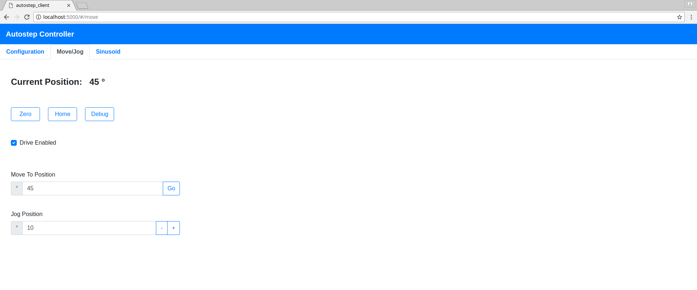

## Autostep 

Firmware + Python and Node.js libraries for controlling stepper motors via the
STMicro L6470 dSPIN stepper motor driver (e.g. Sparkfun Autodriver). The
firmware and libraries were developed to control of various mechanical
components used to study insect behavior.  For example, it is used to control
a rotating platform for certain tethered flight experiments and for controlling a
rotating wind tunnel which tracks the real-time orientation of fly on a 1-DOF
magnetic tether. 


Includes includes methods for:  
* setting basic driver configuration i.e., microstepping, overcurrent threshold, etc.
* setting motion parameters, i.e.,  max velocity, acceleration, etc. 
* basic motor positioning, e.g,  motion point-to-point moves, run at fixed velocity, etc. 
* position feedback via EM3242 angle sensor,
* running sinusoidal trajectories, 
* realtime (closed-loop) trajectory tracking
* provides a web app for ease of system configuration and setup

[API Documentation](http://willdickson.github.io/autostep)

## Web App

### Configuration


### Move and Jog


### Sinusiodal Trajectories


<br>

## Firmware

* Location: "firmware/autostep" sub-directory
* Platform: teensy 3.2
* Install using Aruduino IDE w/ Teensduino Addon

## Python Library

* Location: "softare/python/autostep"
* Requirements: pyserial, numpy, matplotlib

### Installation


```bash
python setup.py install
```

## Javascript (Node.js) Library Installation

* Location: "software/node/autostep"

### Installation

```bash
npm install
```

## Javascript Web App server 

* Location: "software/node/web_app/autostep_server"

### Installation

```bash
npm install
```


## Javascript Web App server 

* Location: "software/node/web_app/autostep_client"

### Installation

```bash
npm install
```


